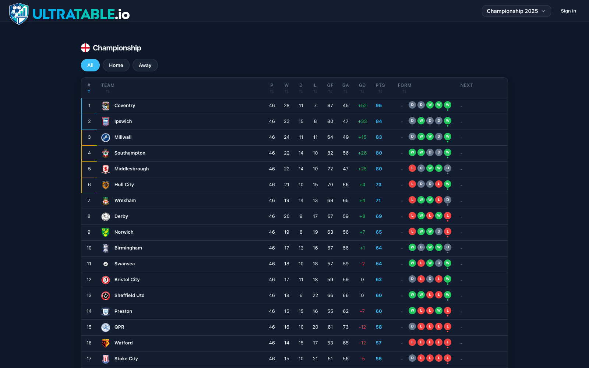
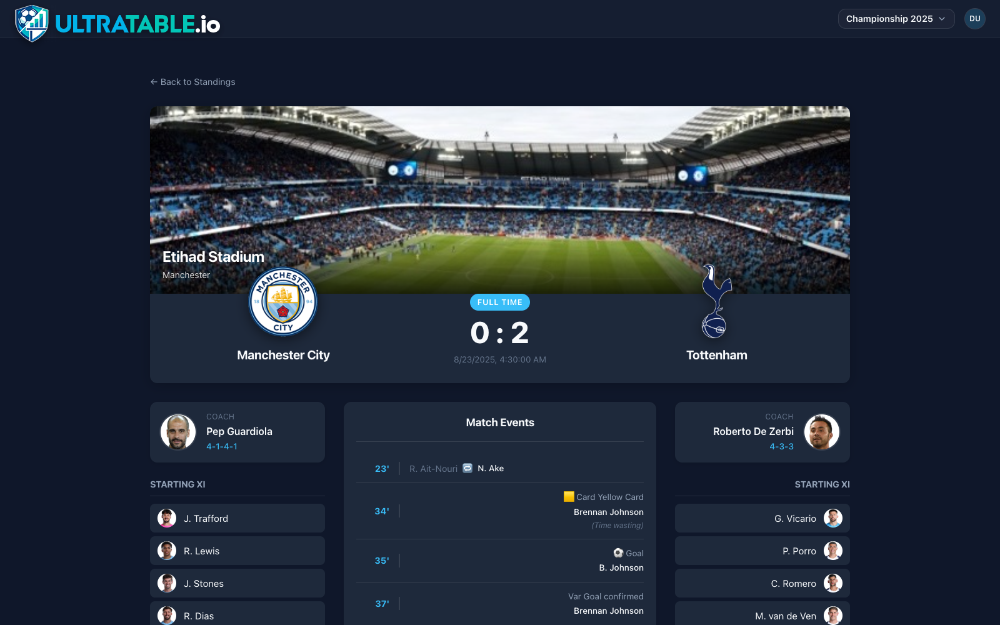
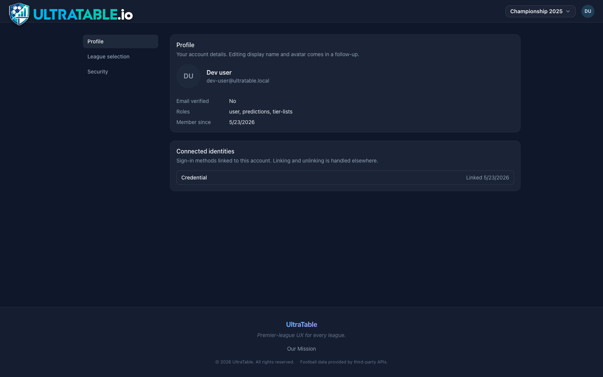
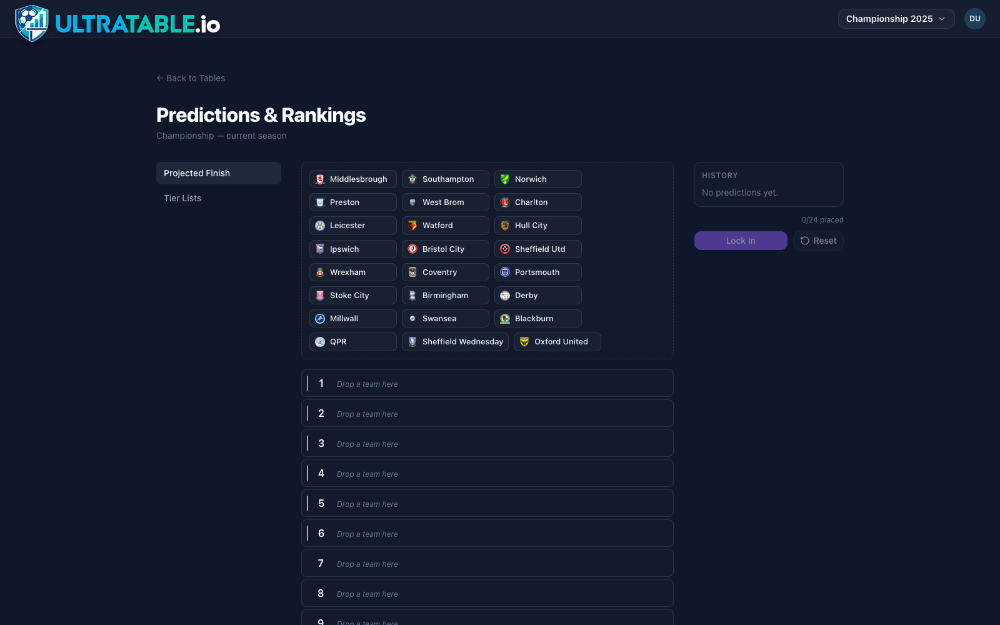
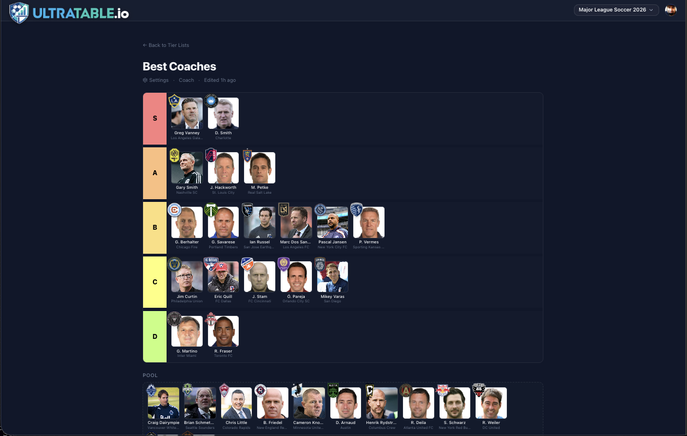
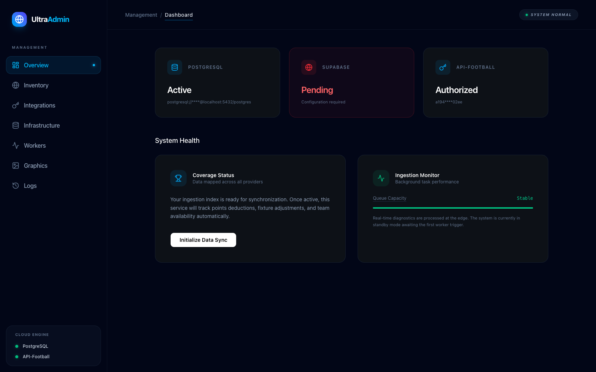
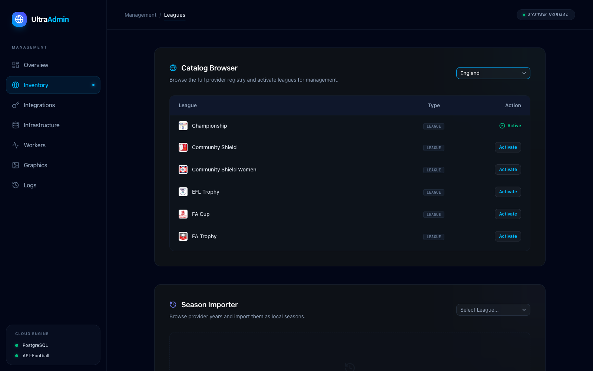
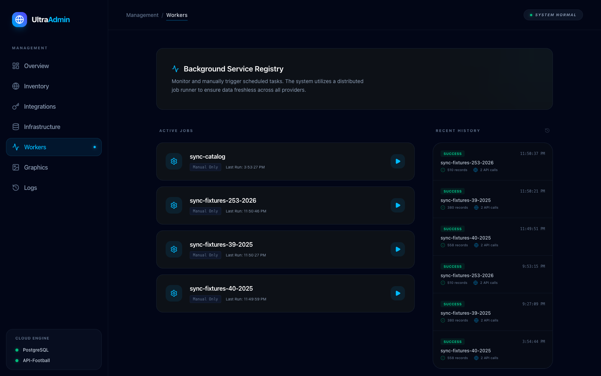
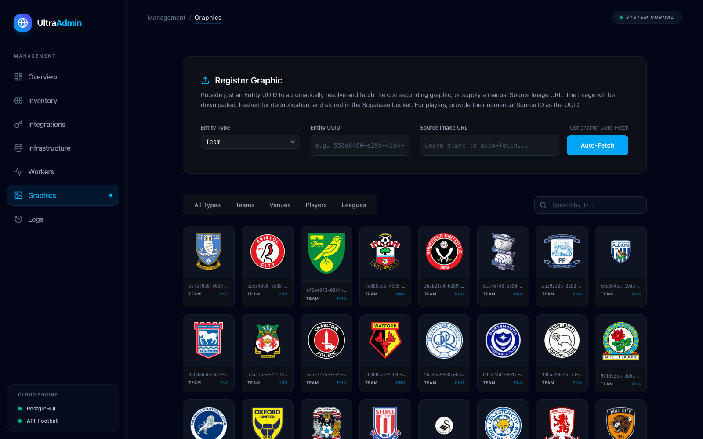
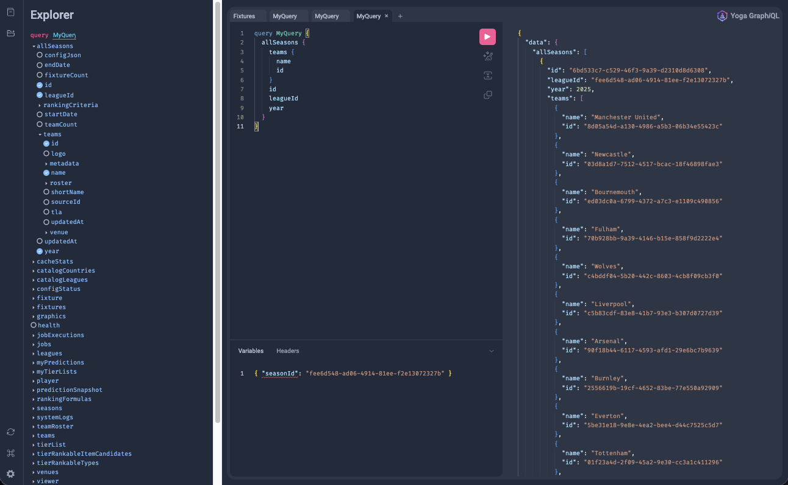

# UltraTable

> **First-class football stats for clubs, fans, and streamers — built end-to-end by one engineer + AI agents.**

UltraTable is two products in one codebase: a **first-class stats surface** for football clubs of all sizes (live league tables, match detail, lineups, event timelines) and a **streamer engagement utility** for TikTok / YouTube broadcasts (Predictions, Tier Lists, and Stream Overlays on the roadmap). It's a TypeScript monorepo — Fastify + GraphQL Yoga + Drizzle on the back, two React 19 SPAs on the front, deployed across Fly.io and Vercel.

This README is also my portfolio. If you're evaluating me for a senior / principal back-end or full-stack role, the [Engineering](#engineering--the-decisions-behind-the-product) section is where I show my work — the architectural decisions, the load-bearing constraints, and the trade-offs I made deliberately. The features below exist to show you what those decisions are in service of.

> **Source-visible, not open-source.** This codebase is published for portfolio review. You may clone and run it locally on your own machine (loopback only) to evaluate it — see [LICENSE](LICENSE) for the full terms. Hosting, public deployment, modification beyond local config, and redistribution are not permitted. For commercial licensing, contact **pdxgeek@gmail.com**.

---

## Table of contents

- [What it does](#what-it-does)
    - [For clubs and fans](#for-clubs-and-fans)
    - [For streamers](#for-streamers)
    - [Operator console](#operator-console)
- [Engineering — the decisions behind the product](#engineering--the-decisions-behind-the-product)
    - [Tech stack at a glance](#tech-stack-at-a-glance)
    - [The architectural contracts](#the-architectural-contracts)
    - [Backend craft](#backend-craft)
    - [Frontend craft](#frontend-craft)
    - [Auth that two products share without leaking into each other](#auth-that-two-products-share-without-leaking-into-each-other)
    - [Tested where it matters](#tested-where-it-matters)
- [Built with AI agents as a force multiplier](#built-with-ai-agents-as-a-force-multiplier)
- [Roadmap](#roadmap)
- [Run it locally / deploy it](#run-it-locally--deploy-it)

---

## What it does

### For clubs and fans

The web app at `apps/web` is a fan-facing surface for any league API-Football covers. Click a country flag, pick a league, get a live table.



- **Live league tables** that recompute from cached fixtures + delta-synced updates — no stale CDN-snapshot feel.
- **Match detail pages** with both teams' lineups, formation, substitutions, goals, cards, and a chronological event timeline.

  

- **Filterable views** (Home / Away / All) computed client-side from the same delta-synced fixture set so swapping the filter is instant.
- **Account pages** with linked identities (Google + credentials), per-league follows, and a self-service "wipe my data" mutation.

  

### For streamers

The wedge for the paid product. Streamers want to make a prediction live on camera, save it, then come back next match-week and show the audience how the table actually played out vs. the prediction.

- **Projected Finish predictions** — drag-and-drop a current league's teams into a top-to-bottom finishing order. Drafts persist in **IndexedDB (Dexie)** keyed per `(viewer, season, type)`, so refreshing the page mid-prediction doesn't cost the user their work, and switching seasons swaps to a clean draft.

  

- **Lock-in and history**. When the streamer hits *Lock in*, the prediction becomes an immutable snapshot. The history panel lets them re-load a previous snapshot to compare against the live table.
- **Tier Lists** (recipe-registry-backed; see [apps/service/src/schema/tier-lists.ts](apps/service/src/schema/tier-lists.ts)) — the same drag-and-drop primitive, now generalized so any `TierRankableType` (teams, players, fixtures, future entities) plugs in.

  

- **Stream Overlays** are next on the roadmap — thin, low-latency overlay renderers that read from the same GraphQL surface. The data layer is already designed for them; see [Roadmap](#roadmap).

### Operator console

`apps/admin` is the back-office for me-as-the-operator: import a league season, watch the ingest workers run, inspect the cache, manage uploaded graphics, read structured logs. It's the **same** GraphQL surface the public app uses — the admin only sees more of it because CASL says so.



| Section          | What it does                                                                                                  |
| ---------------- | ------------------------------------------------------------------------------------------------------------- |
| **Overview**     | Stat cards for DB connectivity, API-Football key health, recent worker activity.                              |
| **Inventory**    | Browse the catalog of leagues, import a season (queues a worker job), edit season config.                     |
| **Integrations** | Rotate the API-Football key without redeploying.                                                              |
| **Infrastructure** | Inspect / configure DB credentials (masked) and Supabase wiring.                                            |
| **Workers**      | Live job list, last 20 executions with status + counts, manual re-run.                                        |
| **Graphics**     | Asset upload + gallery, backed by Supabase storage in prod / MinIO locally.                                   |
| **Logs**         | Tail the last 100 structured Pino records straight from the DB (debug-level logs never hit the database).     |





---

## Engineering — the decisions behind the product

Most of this section links to the actual file where the decision is enforced. Click through — I'd rather you check the code than take my word for it.

### Tech stack at a glance

| Layer            | Choice                                                              | Why                                                                                                                                                          |
| ---------------- | ------------------------------------------------------------------- | ------------------------------------------------------------------------------------------------------------------------------------------------------------ |
| Runtime          | **Node 24** (Volta-pinned)                                          | Native fetch, stable AbortController semantics, top-level await.                                                                                             |
| Web framework    | **Fastify 5** + plugins (`cors`, `cookie`, `rate-limit`)            | Schema-first request validation, fastest mainstream Node server, plugin model that doesn't fight TypeScript.                                                 |
| GraphQL          | **GraphQL Yoga 5** + **Pothos 4** code-first schema                 | Yoga for the runtime (subscriptions-ready, plays with Fastify); Pothos because code-first GraphQL with strict TS inference beats SDL hand-stitching at scale. |
| GraphQL safety   | **graphql-query-complexity** + **DataLoader**                       | Cost limits per request; per-request batchers prevent N+1s by *construction*.                                                                                |
| DB               | **Postgres** via **Drizzle ORM** (migration-first)                  | Drizzle's `$inferSelect`/`$inferInsert` give end-to-end type safety from column → resolver → frontend. Migrations are the canonical path; no `db:push` in CI.|
| Auth             | **Better Auth** (Google OAuth + credentials) + **CASL** for authz   | Better Auth handles sessions + OAuth properly; CASL gives one declarative rule shape shared by server and both frontends.                                    |
| Caching          | **lru-cache** (in-process, per-pod) + Postgres as the system of record | Two-tier: raw API responses keyed by remote ID, mapped domain objects keyed by internal UUID — they never collide.                                         |
| Logging          | **Pino** (structured) → DB sink for warn+                           | Debug-level never hits the DB. Logs are a feature surface (admin Logs view), not just stderr.                                                                |
| Frontends        | **React 19** + **Vite** + **Tailwind v4** + **shadcn/ui** + **Radix** | shadcn/ui vendored into each app so they stay independently buildable. No bespoke focus traps, click-outside handlers, or popup positioning.               |
| Web data layer   | **urql** (GraphQL) + **Dexie** (IndexedDB) for drafts               | urql for normalized GraphQL caching; Dexie for offline-tolerant drag-and-drop drafts the user shouldn't lose.                                                |
| Drag-and-drop    | **@dnd-kit**                                                        | Accessible, virtualization-friendly, modern React.                                                                                                           |
| Storage          | **Supabase Storage** (prod) / **MinIO** (local)                     | S3-compatible local dev means upload code paths are exercised on every PR, not just in prod.                                                                 |
| Hosting          | **Fly.io** (service, always-on Docker) + **Vercel** (web, admin)    | Fly because the GraphQL service needs a long-lived process. Vercel because the SPAs are static + edge rewrites do the OAuth same-origin trick (below).       |
| Quality bar      | **Vitest** unit + integration, **ESLint** zero-warning, **Prettier** | Lint warnings block merge. No `any`. Strict TS everywhere.                                                                                                   |

### The architectural contracts

These are the **non-negotiable rules** I codified for the codebase. Every one of them came from a hard-won bug or a foreseeable failure mode. They live in [AI_README_FIRST.MD](AI_README_FIRST.MD) so both human contributors and AI agents inherit the same guardrails.

- **Dual-ID system.** Every internal row is a Postgres UUID. External provider IDs (API-Football's league `40`, etc.) only live in `source_id` columns and are never accepted where a UUID is expected. GraphQL args that take a provider ID use a `sourceId` suffix, and **every** schema field has a `description` documenting which kind of ID it expects. A `schema-descriptions.test.ts` asserts that. ([AI_README_FIRST.MD §1](AI_README_FIRST.MD))
- **Hybrid SQL + JSONB schema.** A column only exists if the database needs to join on it, index it, filter on it, or sort by it. Everything else lives in `metadata: jsonb`. Display fields don't get migrations.
- **Timestamp & timezone discipline.** Every timestamp column is `timestamptz(3)` — millisecond precision, UTC. A `utcTimestamp()` helper in [`apps/service/src/db/schema.ts`](apps/service/src/db/schema.ts) is the only sanctioned way to declare one. Server-side timestamps use `NOW_MS` (a `date_trunc('milliseconds', now())` wrapper) instead of bare `now()`. This is here because microsecond/millisecond precision drift caused phantom delta-sync bugs once — never again.
- **Storage-agnostic repository facade.** Every resolver imports `{ repository }` from [`apps/service/src/repositories`](apps/service/src/repositories) — a runtime singleton typed against an interface. The Postgres backend lives in `repositories/postgres/` as per-domain sub-repos. Swapping the backend is a single-line change at the index file; resolvers never know.
- **DataLoader is mandatory for nested resolvers.** Any field that fetches a row by ID from a parent's foreign key (`Fixture.homeTeam`, `Team.venue`, …) goes through a per-request DataLoader in [`apps/service/src/loaders/index.ts`](apps/service/src/loaders/index.ts). The rule exists because direct `db.select().where(eq(id, parent.fooId))` is the silent N+1 that takes a list query from 50ms to 5s.
- **Two-tier identity model.** `auth_user` is *who you are with a provider*; `user` is *the account you own in our system*; `auth_link` bridges many → one. **The bootstrap hook never auto-merges by email** — explicit linking is the only path. Anyone who creates a Google account at your address can't merge into your account.
- **Authorization goes through CASL, never inline role checks.** A single per-request `ctx.ability` decides every gate on the server; the same rule shape is mirrored to both frontends so the "button appears but the click 403s" class of bug can't happen.

### Backend craft

- **GraphQL surface is split by domain** ([football.ts](apps/service/src/schema/football.ts), [predictions.ts](apps/service/src/schema/predictions.ts), [tier-lists.ts](apps/service/src/schema/tier-lists.ts), [catalog.ts](apps/service/src/schema/catalog.ts), [graphics.ts](apps/service/src/schema/graphics.ts), [workers.ts](apps/service/src/schema/workers.ts), [viewer.ts](apps/service/src/schema/viewer.ts), [account.ts](apps/service/src/schema/account.ts), [config.ts](apps/service/src/schema/config.ts), [seasonConfig.ts](apps/service/src/schema/seasonConfig.ts)). One Pothos builder, multiple modules — no 5000-line monolithic schema. The playground is mounted in non-prod for hands-on exploration:

  

- **Cache isolation pattern.** Raw API responses live in an LRU keyed by `[endpoint]_[remoteId]_[season]`. Mapped domain lists live in a separate cache keyed by **internal UUID** (`domain_fixtures_<uuid>`). Deleting + recreating a league instantly clears the domain cache for that instance without touching the raw cache, so we don't re-pay the upstream API call. The two never collide. ([AI_README_FIRST.MD §3–4](AI_README_FIRST.MD))
- **Workers are first-class.** Job + execution rows are real entities in the schema with their own resolvers, so the admin console doesn't need a side-channel — it queries the same GraphQL. Execution records carry `processedCount` / `totalCount` / `apiCallsCount` so I can see exactly how expensive an import was.
- **Recipe registry for ranking types.** The Tier Lists feature is built on a `TierRankableType` registry rather than a switch statement. Adding "rank players by goals" is a registration, not a schema migration.
- **Drizzle migrations are the canonical workflow.** `db:generate` → commit the SQL → `db:migrate`. `db:push` exists as an escape hatch and `db:bootstrap` exists to stamp `__drizzle_migrations` on databases that were originally set up via push. The bootstrap script is **idempotent** — that matters because the rollout for issue [#99](../../issues/99) had to upgrade existing dev DBs without forcing a wipe.
- **Production-like local Docker.** [`docker-compose.yml`](docker-compose.yml) builds the service image the same way Fly does. I run `docker compose up --build -d service` periodically so Dockerfile drift can't break a deploy.

### Frontend craft

- **Two SPAs, never coupled at the source level.** `apps/admin` and `apps/web` may eventually deploy as separate containers. There are zero cross-app imports. shadcn/ui primitives are installed per-app via `npx shadcn add` — not copied between apps.
- **Strict TS, no `any`, zero-warning lint.** Enforced in CI.
- **Components stay small and testable.** No monolithic `App.tsx`. The web `App.tsx` is 30 lines; routing fans out to focused page components which fan out to focused subcomponents (`PredictionHistoryPanel`, `ProjectedFinishBoard`, `SectionNav`, …).
- **The viewer query never throws.** `Query.viewer` returns `null` when unauthenticated. Frontends render a signed-out state without try/catch, and [viewer.test.ts](apps/service/src/schema/viewer.test.ts) pins that contract.
- **Tailwind v4 + shadcn theme variables.** One source of truth for design tokens per app; documented in [docs/frontend-patterns.md](docs/frontend-patterns.md).

### Auth that two products share without leaking into each other

[docs/auth-architecture.md](docs/auth-architecture.md) is the deep dive. The headline:

- **Each frontend has its own Google OAuth client** (same Google Cloud project, different consent screens, independent revocation). Public client IDs ship in each frontend's bundle as `VITE_GOOGLE_CLIENT_ID`; secrets live only on the service, namespaced `GOOGLE_CLIENT_SECRET_{ADMIN,WEB}`.
- **The service passes `clientId: [adminId, webId]` to Better Auth** — its canonical cross-platform pattern. Tokens whose `aud` matches *either* client are accepted by the same backend.
- **ID-token sign-in flow.** The browser uses Google Identity Services to fetch an ID token under its own client ID, then POSTs it to the service via `authClient.signIn.social({ provider: 'google', idToken: { token } })`. **No redirect to Google, no per-host dispatch on the service.**
- **Each frontend's edge rewrite proxies `/api/auth/*` to the service** so the session cookie lives on the SPA's own origin (same-site, no `SameSite=None` gymnastics). `BETTER_AUTH_URL` is intentionally unset in production; Better Auth derives the base URL per request from `X-Forwarded-Host`, so each OAuth redirect URI stays on its frontend's hostname.
- **CASL rules live in three files by design** (server + both frontends). They're 30 lines of pure data; a shared package would couple browser and Node bundles for no benefit. Drift is the classic "button renders, click 403s" pitfall, so the [PR-review checklist](docs/auth-architecture.md) calls it out explicitly.

### Tested where it matters

- 54 test files across the monorepo; unit + integration via Vitest.
- The load-bearing pieces have dedicated test files: [auth-bootstrap.test.ts](apps/service/src/services/auth-bootstrap.test.ts), [cache-invalidation.test.ts](apps/service/src/schema/cache-invalidation.test.ts), [rbac.test.ts](apps/service/src/schema/rbac.test.ts), [schema-descriptions.test.ts](apps/service/src/schema/schema-descriptions.test.ts) (asserts every GraphQL field has a description), [viewer.test.ts](apps/service/src/schema/viewer.test.ts), [predictions.test.ts](apps/service/src/schema/predictions.test.ts), [tier-lists.test.ts](apps/service/src/schema/tier-lists.test.ts).
- Frontend tests use `@testing-library/react` + `fake-indexeddb` so the Dexie-backed prediction drafts get real coverage, not mocks.

---

## Built with AI agents as a force multiplier

This codebase was built by one engineer (me) collaborating with AI coding agents. The agents move fast; my job is to make sure they move fast *in the right direction*. Two artifacts make that possible:

- **[AI_README_FIRST.MD](AI_README_FIRST.MD)** — the architectural contracts above, written for an agent who joined the project five seconds ago. Naming conventions, ID rules, timestamp rules, hybrid-schema rules, DataLoader rule, CASL rule, the bootstrap-hook security pitfall, the `/tmp/` rule for utility scripts. Agents read it before touching the schema or the data layer.
- **[CLAUDE.md](CLAUDE.md)** — the operating manual: what to run, where things live, when to re-run `npm run setup` instead of hand-editing `.env`, the never-`pkill` rule. Pure conventions, no architecture.

The result is that an agent picking up a ticket inherits the same constraints a senior teammate would. The dual-ID rule, the DataLoader rule, the "never auto-link by email" rule — none of them have to be re-litigated per PR. **The architectural decisions amortize across every future change**, whether the change is mine or an agent's.

What this enables, concretely: the [recent commit history](../../commits/master) shows multi-PR feature stacks (Predictions, Tier Lists) shipping with their own schema, repository, GraphQL surface, role gates, and UI in a fraction of the calendar time a one-engineer team would normally produce. Every PR still goes through lint + tests + a real review pass — agents accelerate the work, they don't bypass the bar.

---

## Roadmap

- **Stream Overlays** — the monetization wedge. Thin, low-latency overlay renderers that read from the existing GraphQL surface and render a chroma-key-friendly view of a Prediction or Tier List for OBS / Streamlabs. The data layer is already designed for it (Prediction snapshots are immutable; the standings cache is keyed for instant invalidation).
- **More ranking types.** The `TierRankableType` registry is set up to add players, fixtures, and arbitrary domain entities without schema migrations.
- **Database RLS facade.** Currently Drizzle bypasses Supabase RLS because the service connects as a superuser. Plan documented in [docs/DEPLOYMENT.md § Future Hardening](docs/DEPLOYMENT.md).
- **Per-club tenancy.** Clubs onboarding their own stats surface will need org-scoped CASL rules and a tenancy column on the relevant tables. The CASL pattern is already in place; the work is mechanical.

---

## Run it locally / deploy it

- **Local development** — see [docs/getting-started.md](docs/getting-started.md). One command (`npm run setup`) provisions everything; `npm run dev` starts all three services.
- **Deployment to Fly.io + Vercel** — see [docs/DEPLOYMENT.md](docs/DEPLOYMENT.md).
- **Auth architecture** — see [docs/auth-architecture.md](docs/auth-architecture.md).
- **Frontend patterns** (shadcn theme contract, vendoring rule) — see [docs/frontend-patterns.md](docs/frontend-patterns.md).
- **Agent-facing architectural contracts** — see [AI_README_FIRST.MD](AI_README_FIRST.MD).

```bash
# TL;DR
npm run setup    # prompts for Postgres mode + API key, writes .env files
npm run dev      # starts service (8080) + admin (5174) + web (5175)
```

Local URLs: [Web](http://localhost:5175) · [Admin](http://localhost:5174) · [GraphQL Playground](http://localhost:8080/graphql) · [Health](http://localhost:8080/healthz)

---

**Contact:** pdxgeek@gmail.com — for commercial licensing or to talk about hiring me.
